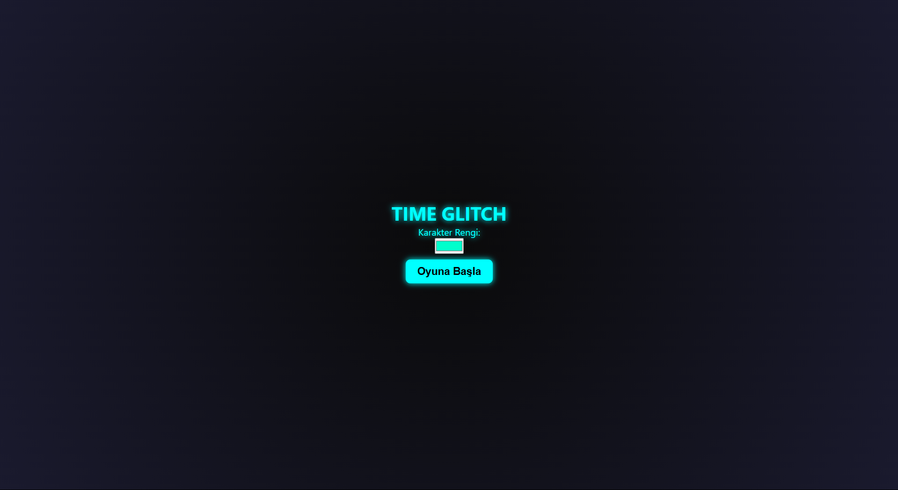
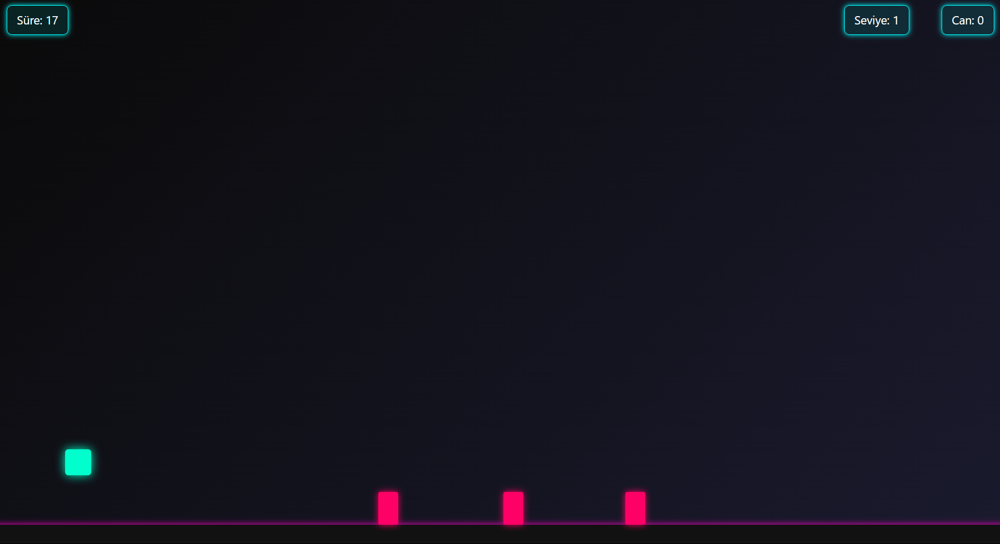
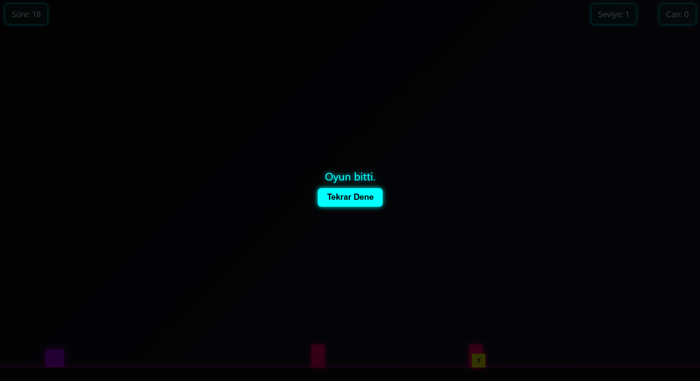

# 🎮 TIME GLITCH V1.3

> 🧠 "Zamanı doğru kontrol edemeyen, geçmişe mahkûmdur."

**TIME GLITCH**, HTML, CSS ve JavaScript kullanılarak geliştirilmiş, zaman temalı bir platform oyunudur. Oyuncu sonsuz bir düzlemde ilerlerken zamanın kontrolünü elinde tutmak zorundadır. Her seviyede farklı zorluklar oyuncuyu beklerken, oyun hem refleks hem dikkat gerektirir.

---

## 🔗 Oynamak İçin Tıkla

---

## 🧠 Oynanış Özellikleri

### 🎯 Otomatik İlerleyen Karakter
Karakter, oyuncudan herhangi bir yön girdisi olmaksızın sürekli olarak sağa doğru ilerler. Oyuncunun tek yapması gereken doğru zamanda **zıplamak (`W`)** veya **eğilmek (`S`)** gibi aksiyonları gerçekleştirmektir. Bu yapı, oyuncunun tüm dikkatini engellerden kaçma ve zamanlama üzerine yoğunlaştırmasını sağlar.

### ⏳ Zaman Sınırı
Her seviye belirli bir süre boyunca devam eder. Bu süre bitene kadar oyuncu hiçbir engele çarpmamalı ve zaman durmalarını başarıyla tamamlamalıdır.

- Seviye 1: 20 saniye  
- Seviye 2: 30 saniye  
- Sonraki her seviye: +10 saniye

Süre bittiğinde seviye tamamlanmış sayılır ve sonraki seviyeye geçiş yapılır.

### ⏹️ Zaman Durması Mekaniği
Belirli aralıklarla oyun durur ve ekranda rastgele 1-3 adet **ok yönü tuşu** (⬅️⬆️➡️⬇️) görünür. Oyuncunun bu tuşlara belirli bir sürede eksiksiz basması gerekir.

- Tuş sayısı seviye ilerledikçe artar.  
- Tepki süresi seviye ilerledikçe azalır.  
- %100 başarı sağlanırsa oyun devam eder.  
- Eksik veya yanlış tuş basılırsa oyuncu seviye kaybeder veya oyunu kaybeder.
  

### 🌀 Glitch Cezası
Yanlış tuşa basıldığında veya doğru sürede basılmazsa ekranda anlık **glitch (bozulma)** efekti çıkar. Bu sadece görsel bir efekt değil, aynı zamanda **zaman çizgisinde bozulma hissini** yansıtır. Hatalı hamle sonrası oyun cezası anında uygulanır.

### ❓ Sürpriz Kutular (?)
Platform üzerinde rastgele yerleştirilmiş sarı renkli `?` kutuları vardır. Karakter bu kutuya temas ettiğinde rastgele bir zaman etkisi devreye girer:

- **Zaman hızlandı!** → Süre daha hızlı akar
- **Zaman yavaşladı!** → Süre daha yavaş akar

### ❤️ Can Sistemi
Zaman durmaları sırasında tüm tuşlara eksiksiz ve zamanında basılırsa **oyuncuya 1 can verilir.**  
Canlar, oyuncunun başarısız olması durumunda kaldığı yerden devam etmesini sağlar. Tüm canlar bittiğinde oyun sona erer.

### ⏸ Pause Özelliği (ESC)
Oyuncu istediği zaman `ESC` tuşuyla oyunu durdurabilir. Açılan **pause menüsünde** şunları yapabilir:

- Oyuna devam et  
- Müziği aç/kapat  
- Müzik sesini ayarla  
- Ana menüye dön (oyun sıfırlanır)

Pause sırasında tüm mekanikler (zaman, hareket, zaman durması) durur.

### 🎨 Karakter Rengi Seçimi
Oyunun başında oyuncuya bir **renk seçme alanı (color picker)** sunulur. Bu sayede oyuncu karakterine istediği rengi verebilir. Seçilen renk hem karakterin görünümünü hem de parlayan neon efektini etkiler.

### 🏁 Seviye Geçişi
Bir seviye başarıyla tamamlandığında ekran kararır ve oyuncuya “Diğer Seviyeye Geç” butonu gösterilir. Bu butonla bir sonraki seviyeye geçiş başlar. Bu sayede oyuncuya nefes alma fırsatı tanınır ve akış kontrolü oyuncuya bırakılır.

### 🔴 Game Over
Tüm canlar bittiğinde oyun sona erer ve **“Tekrar Dene”** butonu belirir. Arka plan durur, zaman ilerlemez. Oyuncu yeniden başlamak isterse bu butona tıklayarak 1. seviyeden başlayabilir.

---

## 🎮 Kontroller

| Tuş       | İşlev                      |
|-----------|----------------------------|
| `W`       | Zıpla                      |
| `S`       | Eğil (animasyon)           |
| `ESC`     | Oyunu durdur (Pause)       |
| `←↑→↓`    | Zaman durması sırasında yön seçimi |

---

## 🧱 Teknolojiler

- `HTML` – Yapı  
- `CSS` – Tasarım (Cyberpunk teması, neon efektler, animasyonlar)  
- `JavaScript` – Oyun motoru, zaman kontrolü, çarpışma, tuş tepkisi, DOM güncellemeleri

---

## ⚙️ Kodun Ana Yapısı

| Dosya       | Açıklama                                                                 |
|-------------|--------------------------------------------------------------------------|
| `index.html`| Oyunun HTML yapısı. Menü, oyun sahnesi, UI öğeleri burada tanımlanır.    |
| `<style>`   | CSS ile tüm görsel tasarım, animasyon ve responsive yapı sağlanır.       |
| `<script>`  | JavaScript ile oyun mantığı: hareket, çarpışma, zaman kontrolü vs.       |
| `sounds/`   | Arka plan müziği dosyası (`background.mp3`)                              |
| `screenshots/` | Oyun ekran görüntülerini içerir (GitHub tanıtım için)                |

---

## 🧠 Önemli Fonksiyonlar ve Kodun Mantığı

### 🔁 `startLevel()`
Yeni seviye başlatır. Süre, oyuncu pozisyonu ve oyun mekanikleri sıfırlanır.

### ⌛ `startTimer()`
Süreyi her saniye azaltır. Süre bittiğinde `nextLevel()` çağrılır.

### ⏹️ `pauseGameForArrow()`
Zamanı durdurur ve ekrana ok yönleri getirir. Oyuncudan doğru tuşlara zamanında basması istenir.

### ❌ `handleArrowFail()`
Zaman durması başarısız olursa cezaları uygular: seviye düşüşü veya oyun bitişi.

### 🌀 `glitchEffect()`
Kısa süreli görsel glitch efekti uygular. CSS animasyonuyla desteklenir.

### 💀 `loseLifeOrRestart()`
Can varsa seviye yeniden başlatılır, can yoksa Game Over ekranı gösterilir.

### 🧱 `checkCollisions()`
Karakterin engeller ve kutularla çarpışmasını kontrol eder. Çarpışma varsa can düşer veya kutu etkisi uygulanır.

### 📦 `scheduleObstacles()`
Belirli aralıklarla yeni engel ve kutular üretir. Zorluk seviyesine göre zamanlamalar değişir.

### 🧭 `pauseMenu` ve `levelTransition`
Oyun durduğunda veya seviye geçildiğinde ekran duraklatılır, kullanıcı girişi beklenir.

### 🎨 `applyCharacterColor()`
Oyuncunun seçtiği renk karaktere uygulanır. Neon efekti görsellik kazandırır.

---

## 📝 Notlar
- README.md dosyası ve oyun arayüzü Türkçe hazırlanmıştır ancak kodlar bilerek İngilizce hazırlanmıştır. Yakın zamanda tüm proje İngilizce olarak güncellenecektir.
- Oyun mobil cihazlar için optimize edilmemiştir. Tarayıcıda oynanması tavsiye edilir.
- Geliştirme sırasında tamamen Vanilla JavaScript (kütüphanesiz JS) kullanılmıştır.
- Tüm efektler (glitch, neon, zaman donması) saf CSS ve JS ile yapılmıştır.

---

## 👨‍💻 Geliştirici

**Ad Soyad:** Ahmet Emin GENÇ  
**Üniversite:** Ege Üniversitesi  
**Bölüm:** Ön Yüz Yazılım Geliştirme

---

## 📷 Ekran Görüntüleri

### 🟢 Ana Menü  
  

### 🕹️ Oyun İçi  
  

### 🧩 Zaman Durması Mekaniği  
  

### ⏸ Pause Menüsü  
  

### 🏁 Seviye Geçişi  
  

### 🔴 Game Over  
  

---

## 🚀 Geliştirme Fikirleri

- 🧠 Skor ve yüksek skor sistemi (localStorage
- ⚡ Karakter yetenekleri (çift zıplama, zaman yavaşlatma)
- 📱 Mobil uyumlu kontroller
- 🏆 İstatistik ekranı ve başarı sistemi
- 🔊 Ekstra ses efektleri (zıplama, kutu alma, zaman durması, hata yapma vs.)
- 📦 Eğilerek geçilmesi gereken ek engeller

---

## 🔴 Bilinen Hatalar
- Platformdaki engeller iç içe veya aralıksız oluşabiliyor. (geçici çözüm için karakterin zıplama animasyonu çalıştığı anda engele çarpmak engeli yok ediyor)
- Bazı durumlarda Pause sırasında zaman durması mekaniği çalışmaya devam ediyor ve glitch cezası uygulanıyor.
- Bazı durumlarda seviye süresi bittiği halde oyun arkaplanda devam ediyor ve karakter bir engele çarparsa oyun kaybediliyor.
- Nadiren, Seviye 1 başarıyla tamamlandıktan sonra Seviye 2 yerine Seviye 3'e geçiş oluyor (v1.3 ile çözüldü)
- Bazı durumlarda Seviye 3'ten itibaren, Ana Menü'ye dönmek veya oyunu kaybetmek seviyeyi sıfırlamıyor.
- Bazı durumlarda Seviye 3'ten itibaren, tüm zaman durmaları başarıyla tamamlansa bile can kazanma sistemi çalışmıyor.

---
